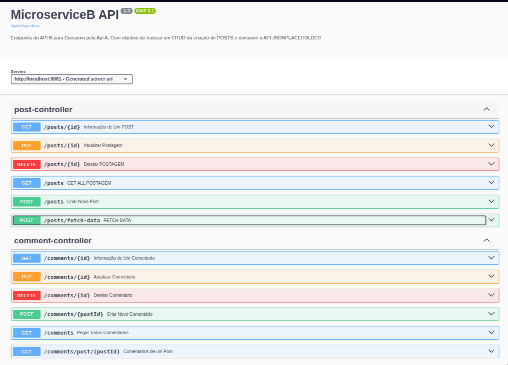

# Micro Serviço B

Implementação de uma API que se conecte à [JSON Placeholder](https://jsonplaceholder.typicode.com) para obter todos os posts e comentários disponíveis.

Os dados são armazenados em um banco de dados, garantindo persistência e integridade. Desse modo, a API deve fornecer endpoints estruturados e documentados para que o MicroServiço A possa consumir esses dados, permitindo operações de CRUD (CREATE - READ - UPDATE - DELETE)



## Variáveis de Ambiente

Para configurar as variáveis de ambiente do projeto, é preciso adicionar as seguintes variáveis de ambiente no seu .env.properties, ultilize o [.env-example.properties](https://github.com/CompassDesafio2/Api-2/blob/main/src/main/resources/.env-example.properties) como base, mas aqui são as variáveis necessárias:


`spring.data.mongodb.host`

`spring.data.mongodb.port`

`spring.data.mongodb.database`

`spring.data.mongodb.username`

`spring.data.mongodb.password`

`spring.data.mongodb.authentication-database`

## Instalação

Clone o [Repositorio](https://github.com/CompassDesafio2/Api-2) é execute o Spring com a própria IDE, se possível;

Se não, utilize o seguinte comando, caso tenha o Maven instalado em seu computador.

```bash
    mvn spring-boot:run  
```


Verifique o log de inicialização do Spring para ver se tudo está rodando conforme o planejado.


## Documentação da API

Rota para acessar o Swagger: [localhost:8081/api/v1/docs/](http://localhost:8081/api/v1/docs/)

#### Endpoint para o Swagger

```http
  GET http://localhost:8081/api/v1/docs/
  ```


---
### Rotas de Postagens


| MÉTODO    | ROTA                | Descrição                                   |
|:----------|:--------------------| :------------------------------------------ |
| `GET`     | `/posts/fetch-data` | Faz a Atualização de todos os Post e Comentários   |
| `GET`     | `/post/`            | Retornar **TODOS os POST** salvos na aplicação |
| `GET`     | `/post/{id}`        | Retornar **1 POST por ID** |
| `/post/`  | `POST `             | **Criar** um novo POST |
| `PUT`     | `PUT /post/{id}`    | **Atualizar** um POST pelo ID |
| `DELETE ` | `/post/{id}`           | **Deletar** um POST pelo ID |


___


## Autores

GRUPO 2: Javeiros Squad


TIME do MICRO SERVICO A:
- [@Rafaelmjmj](https://github.com/Rafaelmjmj)
- [@thebabiL](https://github.com/thebabiL)


TIME do MICRO SERVICO B:
- [@educentenaro](https://github.com/educentenaro)
- [@zander404](https://www.github.com/zander404)


## Licença

[MIT](https://choosealicense.com/licenses/mit/)

